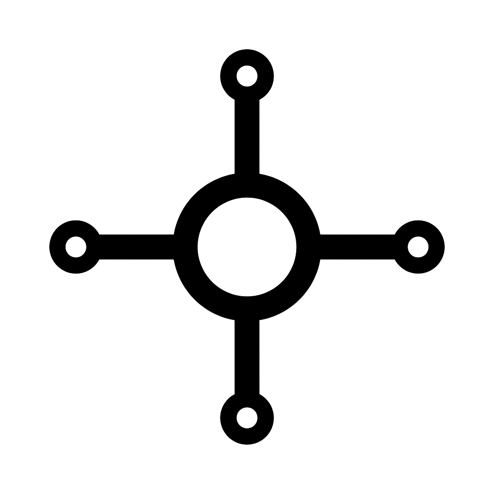
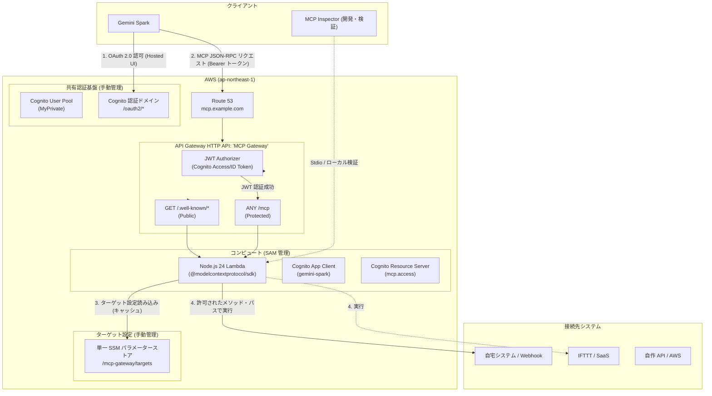

<div align="center">
  
  <h1>MCP Gateway</h1>
  <p><strong>Gemini Spark x AWS Serverless Universal API Bridge</strong></p>
</div>

Gemini Spark の自律的な判断結果を、安全に外部システムや自宅環境、Webhook へ反映・実行するための**自分専用汎用 MCP Gateway** です。

---

## 1. コンセプト・設計思想

```
情報収集・判断・自律処理
    = Gemini Spark (LLM)

外部への実行・状態変更
    = MCP Gateway (本リポジトリー)
```

- MCP を単なる「情報取得のための入口」ではなく、**「Spark が判断した結果を外部へ安全に反映するための出口」** として位置付けます。
- 特定業務専用ではなく、SSM パラメーターストアで管理された接続先（自宅サーバー、IFTTT、自作 API 等）へリクエストを中継する**汎用ゲートウェイ**として機能します。

---

## 2. 全体アーキテクチャー



---

## 3. 前提条件

- **Docker / Docker Compose**: パッケージ管理や SAM ビルド・デプロイはすべてコンテナ内で実行します（ホスト環境を汚しません）。
- **AWS CLI 認証情報**: `~/.aws` がコンテナに読み取り専用でマウントされます。
- **Route 53 パブリックホストゾーン**: カスタムドメイン（例: `example.com`）
- **ACM パブリック証明書**: `ap-northeast-1`（東京リージョン）で発行済みの証明書

---

## 4. 事前準備（手動リソースの作成）

本プロジェクトでは、共有認証基盤と接続先設定を SAM スタックから分離して手動管理します。

### 4.1. Cognito ユーザープールの作成
1. AWS マネジメントコンソール（または AWS CLI）でユーザープール **`MyPrivate`** を作成します。
2. ユーザープールドメイン（プレフィックスドメイン、例: `myprivate-auth-<アカウントID>`）を設定します。
3. ユーザー（例: `admin@example.com`）を作成し、パスワードを確定（`CONFIRMED`）状態にします。
   ```bash
   # CLI 例
   docker compose run --rm app aws cognito-idp admin-set-user-password \
     --user-pool-id <USER_POOL_ID> \
     --username "<USERNAME>" \
     --password "<PASSWORD>" \
     --permanent
   ```

### 4.2. SSM パラメーターストアの設定
1. パラメーター名 **`/mcp-gateway/targets`**（String型）を作成します。
2. 接続を許可するターゲットを人間が編集しやすいインデント付き JSON で登録します。
   ```json
   {
     "IFTTT": {
       "baseUrl": "https://maker.ifttt.com",
       "allowedMethods": ["POST"]
     },
     "HomeServer": {
       "baseUrl": "https://homeserver.example.com",
       "allowedMethods": ["GET", "POST"]
     }
   }
   ```

---

## 5. 環境設定

`.env.example` をコピーして `.env` を作成し、各環境のパラメータを設定します。

```bash
cp .env.example .env
```

※ 設定項目の詳細は `.env.example` を参照してください。

---

## 6. ビルド & デプロイ

すべての作業は Docker コンテナ内で実行します。

```bash
# 1. コンテナイメージのビルド & 依存関係インストール
docker compose build
docker compose run --rm app npm install

# 2. 単体テスト & 型チェック
docker compose run --rm app npm run typecheck
docker compose run --rm app npm test

# 3. SAM アプリケーションのビルド
docker compose run --rm app sam build

# 4. AWS へのデプロイ (.env の設定値を使用してデプロイ)
docker compose run --rm app npm run deploy
```

---

## 7. Gemini Spark 連携設定

Gemini Spark の Custom MCP 設定画面で以下を入力して連携します。

| 項目 | 設定値 |
| :--- | :--- |
| **MCP サーバー URL** | `https://<DOMAIN_NAME>/mcp` |
| **認証方式** | OAuth 2.0 (認可コードグラント) |
| **Discovery URL** | `https://<DOMAIN_NAME>/.well-known/oauth-authorization-server` |
| **クライアント ID** | デプロイ出力の `ClientId` |
| **クライアントシークレット** | Cognito App Client の Client Secret |
| **スコープ** | `https://<DOMAIN_NAME>/mcp.access` |

> [!NOTE]
> Gemini Spark 側の Redirect URI（例: `https://oauth-redirect.googleusercontent.com/r/...`）は、`template.yaml` の `CognitoUserPoolClient.Properties.CallbackURLs` に定義されています。

---

## 8. 開発・動作検証キット

### 8.1. MCP Inspector によるローカル対話検証
ブラウザー UI から MCP ツール（`call_api`）の動作やレスポンスを直接テストできます。

```bash
# ローカルサーバーのビルド
docker compose run --rm app npm run build:local

# MCP Inspector の起動 (ポート 5173 を公開)
docker compose run --rm -p 5173:5173 app npm run inspect
```
ブラウザーで `http://localhost:5173` を開き、ツールの実行を対話的に確認できます。

### 8.2. E2E 統合検証スクリプト
AWS 上にデプロイされたエンドポイントに対して、実際のトークン取得から MCP ツール呼び出し（`/busy/turn?id=101`）までを一括検証します。

```bash
docker compose run --rm app node scripts/verify-integration.mjs <CLIENT_ID> <CLIENT_SECRET> HomeServer "/busy/turn?id=101"
```

---

## 9. MCP ツール仕様

### `call_api`
事前に SSM パラメーターストアに登録されたターゲットに対して HTTP リクエストを発行します。

- **引数**:
  - `target` (必須, string): ターゲット名（例: `HomeServer`, `IFTTT` / 大文字小文字不問）
  - `path` (任意, string): Base URL に対する相対パス（例: `/busy/turn?id=101`）
  - `method` (必須, string): `GET` | `POST` | `PUT` | `PATCH` | `DELETE`
  - `headers` (任意, object): 追加リクエストヘッダー
  - `query` (任意, object): クエリーパラメーター
  - `body` (任意, string): リクエストボディ（JSON 文字列、テキスト、または URL エンコード文字列）
  - `formData` (任意, object): フォーム POST（`application/x-www-form-urlencoded`）用のキー・値マップ。自動的に URL エンコード形式に変換されます。

---

## 10. ライセンス

MIT
